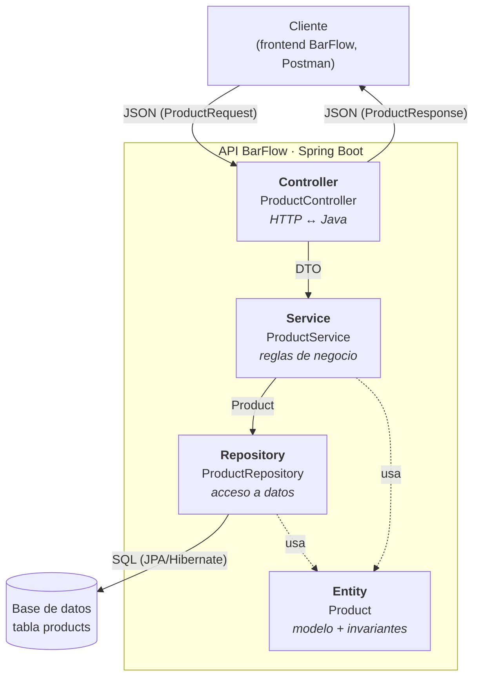
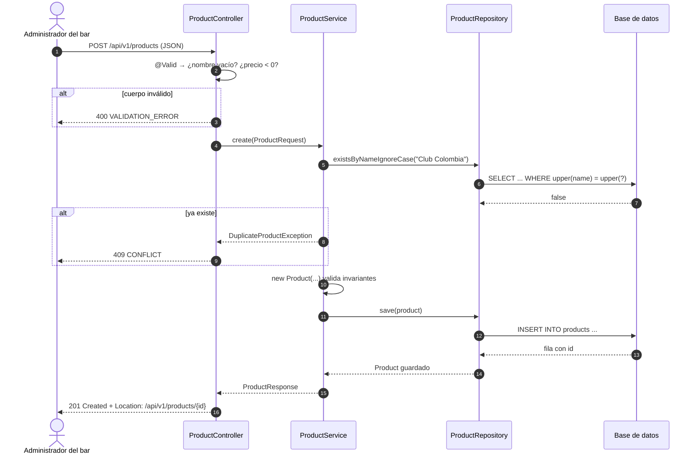

# BarFlow — Arquitectura en capas de la API (Semana 6)

Actividad opcional de refuerzo · Complementaria III — Desarrollo Fullstack · 2026-B
**Autor:** William Erney Collo Narvaez (`11William11`)

## El caso

**BarFlow** es la plataforma de gestión para bares que vengo construyendo en el
curso (en la semana 4 hice la vista de pedidos). Para esta actividad diagramo la
API del **catálogo de productos** del módulo `inventory`: los productos que vende
el bar (cervezas, licores, bebidas) con su precio y su stock.

| Recurso | Endpoints |
|---|---|
| `Product` | `GET /api/v1/products` · `GET /api/v1/products/{id}` · `POST /api/v1/products` · `PUT /api/v1/products/{id}` · `DELETE /api/v1/products/{id}` |

## Diagrama de capas



Las flechas van **en un solo sentido**: el controller conoce al service, el
service conoce al repository, y nadie conoce a la capa de arriba. Así cada capa
se puede probar sola y cambiar sin romper las demás.

## Responsabilidad de cada capa

| Capa | Clase en BarFlow | Qué hace | Qué **no** hace |
|---|---|---|---|
| **Controller** | `ProductController` | Recibe la petición HTTP, valida la forma del JSON (`@Valid`), llama al service y arma la respuesta con el código correcto (`200`, `201`, `204`, `404`...). | No tiene reglas de negocio ni habla con la base de datos. |
| **Service** | `ProductService` | Aplica las reglas del negocio: no repetir el nombre de un producto, el precio es un entero de pesos ≥ 0, el stock nunca baja de cero (BR-02). Define la transacción (`@Transactional`). | No conoce HTTP (ni `ResponseEntity` ni códigos de estado). |
| **Repository** | `ProductRepository` | Lee y guarda productos. Extiende `JpaRepository`, así que hereda el CRUD y agrega consultas como `findByCategory...`. | No toma decisiones de negocio. |
| **Entity** | `Product` | Representa una fila de la tabla `products` (`@Entity`, `@Id`, columnas) y protege sus invariantes (no acepta precio ni stock negativos). | No sabe cómo se guarda ni quién la usa. |

Además hay dos piezas de apoyo que cruzan las capas sin romper la dirección:

- **DTOs** (`ProductRequest`, `ProductResponse`): lo que entra y sale por HTTP. La
  entity nunca se expone directamente, así un cambio en la tabla no rompe el
  contrato de la API.
- **Manejador de errores** (`@RestControllerAdvice`): traduce las excepciones del
  service (`ProductNotFoundException`, `DuplicateProductException`) al formato de
  error de BarFlow: `{ "error", "message", "details" }`.

## Endpoint de ejemplo: registrar un producto

`POST /api/v1/products`

```json
{ "name": "Club Colombia", "category": "Cervezas", "price": 6000, "stockQuantity": 36 }
```



**Por qué pasa por cada capa:**

1. **Controller:** es la puerta de entrada HTTP. Revisa que el JSON tenga la forma
   correcta antes de gastar una consulta a la base de datos.
2. **Service:** decide si el producto se puede registrar (regla de nombre único)
   y construye la entity, que valida sus propias invariantes.
3. **Repository:** hace el `SELECT` de verificación y el `INSERT`, sin saber por
   qué.
4. **Entity:** `Product` es lo que viaja entre el service y el repository y lo que
   se convierte en la fila de la tabla.

Si la petición fuera `GET /api/v1/products/{id}` con un id que no existe, el
repository devuelve `Optional.empty()`, el service lanza
`ProductNotFoundException` y el manejador de errores responde `404 NOT_FOUND`: el
controller nunca tiene que escribir un `if` para eso.

## Relación con el diseño de BarFlow

En la documentación del proyecto las capas se llaman *presentation*,
*application*, *persistence* y *domain*. Son las mismas cuatro de esta
actividad:

| Actividad (Spring) | Documentación BarFlow |
|---|---|
| Controller | Presentation |
| Service | Application |
| Repository | Persistence |
| Entity | Domain |

La implementación de estas capas está en las entregas de las semanas
[7 (entity + repository)](../../../07-week/02-optional-activity/barflow-entity-repository/)
y [8 (CRUD REST completo)](../../../08-week/02-optional-activity/barflow-products-crud/).
